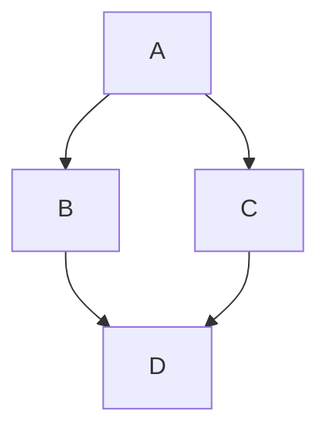

# Hello MashDiewer

This is a **test** markdown file to verify the rendering.

- Item 1
- Item 2

## コード  
```javascript
console.log("Hello from MashDiewer!");
```

### テーブル  
| Header 1 | Header 2 | Header 3 |
|----------|----------|----------|
| Cell 1   | Cell 2   | Cell 3   |
| Cell 4   | Cell 5   | Cell 6   |

## Mermaid テスト


